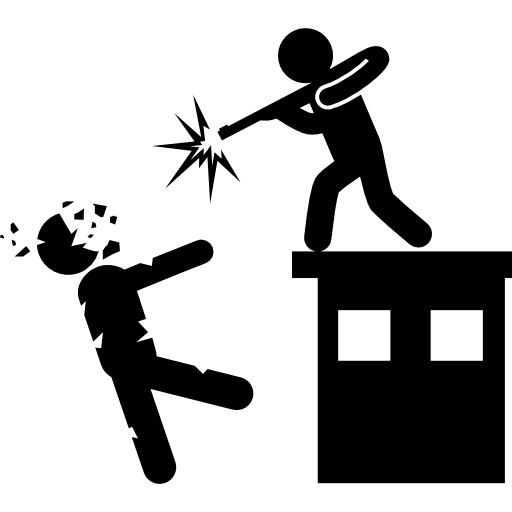

# gun ownership vs. death/injury rates

Data on gun ownership and death/injury rates

Data from https://theconversation.com/gun-control-in-america-by-the-right-and-wrong-numbers-49573

See associated blog post: https://conservationbytes.com/2017/10/17/dangers-of-forcing-regressions-through-the-origin/
